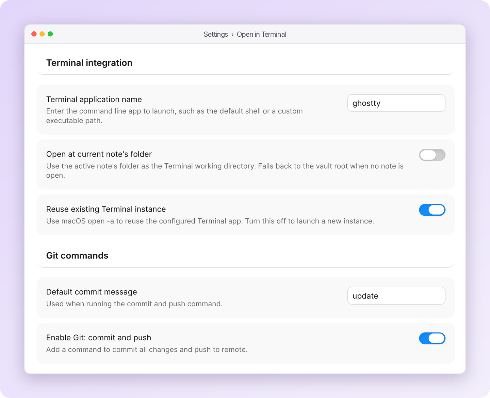

# Open in Terminal

Open your Obsidian vault in a terminal — or start Claude Code, Codex, Gemini CLI and other coding agents inside it — straight from the command palette.

  
  
  

  

## Features

- **Open the vault in your terminal** — one command opens your terminal at the vault root, or at the current note's folder if you prefer.
- **Start a coding agent in your vault** — Claude Code, Codex CLI, GitHub Copilot, Cursor CLI, Gemini CLI and OpenCode each get their own command. Turn on only the ones you use.
- **Hand the agent your current note** — optionally start the agent with the note's path in its prompt, wrapped in your own prefix and suffix.
- **Git in one command** — `Git: commit and push` and `Git: pull`, always run from the vault root.
- **Works on macOS, Windows and Linux** — with sensible defaults per platform, and settings stored per platform so a synced vault works on every machine.

## Install

In Obsidian, open **Settings → Community plugins → Browse**, search for **Open in Terminal**, then install and enable it. Or open the [plugin page](https://community.obsidian.md/plugins/open-in-terminal) and click **Add to Obsidian**.

## Commands

| Command | What it does |
|---|---|
| **Open in terminal** | Opens your terminal at the working directory |
| **Open in Claude Code** | Runs `claude` |
| **Open in Codex cli** | Runs `codex` |
| **Open in GitHub Copilot** | Runs `copilot` |
| **Open in Cursor cli** | Runs `agent` |
| **Open in Gemini cli** | Runs `gemini` |
| **Open in OpenCode** | Runs `opencode` |
| **Git: commit and push** | Runs `git add . && git commit -m "<default message>" && git push` |
| **Git: pull** | Runs `git pull` |

Everything except **Open in terminal** is off until you enable it in settings. The CLI tools themselves must already be installed.

## Settings

- **Terminal application** — the terminal to launch, such as `Terminal` or `iTerm` on macOS, `powershell` or `cmd.exe` on Windows, `gnome-terminal` or `alacritty` on Linux. Leave it blank for the platform default. Enter an app name or executable path, without arguments.
- **Open at current note's folder** — use the active note's folder as the working directory; falls back to the vault root when no note is open.
- **Include current note in prompt** — off by default. When on, coding agents start with your prefix, the note's path and your suffix as one prompt, with a live preview in settings. Plain terminal and Git commands never receive it.
- **Reuse existing terminal instance** (macOS) — reuse the running terminal app; turn it off to launch a new instance.
- **Coding agents** — a switch for each agent command.
- **Git commands** — a default commit message (`update`) and a switch for each Git command.
- **Use WSL for commands** (Windows) — run everything inside WSL.

## Platform notes

- **macOS** — Terminal and iTerm are fully supported. Coding agents start through a temporary `.command` script in a login shell, so other terminals need to be able to open `.command` files.
- **Windows** — supports CMD, Windows PowerShell, PowerShell 7, Windows Terminal and Tabby, with or without WSL.
- **Linux** — requires Bash. GNOME Terminal and terminals that accept `-e` work out of the box.

The plugin never turns on auto-approval or skips a CLI's own permission checks. When it passes your note as a prompt, the agent may start working on it right away.

## Privacy

This is a desktop-only plugin that launches programs on your computer: it starts your terminal and runs the commands you choose. On macOS and Windows it writes a temporary launch script outside the vault and deletes it after launch; on Windows that script runs with a process-scoped execution policy, without changing your system settings. `Git: commit and push` stages everything under the vault root before committing.

The plugin itself sends nothing over the network. Whatever coding agent you launch decides what it reads and sends.

## About the author

I'm [chenfeng](https://github.com/Feng6611). I also made [File Ignore](https://github.com/Feng6611/Obsidian-File-Ignore), which keeps folders like `node_modules` out of Obsidian's index, and I build small, permission-light Mac apps — like [Command Reopen](https://commandreopen.com), which fixes Cmd+Tab for minimized windows. If this plugin saves you time, you can [buy me a coffee](https://buymeacoffee.com/kkuk).
