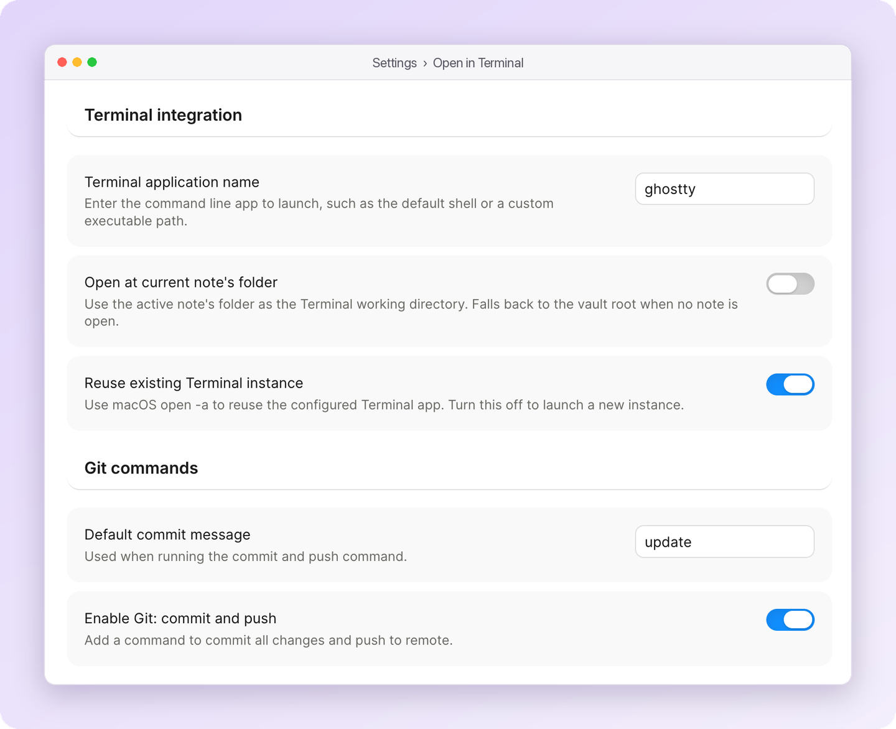

# Open in Terminal

Open your Obsidian vault in a terminal, or launch Claude Code, Codex, Gemini CLI, and other coding agents inside it, directly from the command palette.

  
  
  

  

## Features

- **Open the vault in your terminal** — Run a single command to open your terminal at the vault root or at the folder of your active note.
- **Launch coding agents in your vault** — Dedicated commands for Claude Code, Codex CLI, GitHub Copilot, Cursor CLI, Gemini CLI, and OpenCode. Enable only the agents you use.
- **Pass the active note to your agent** — Optionally include the current note path in the agent prompt with customizable prefix and suffix text.
- **One-command Git operations** — Run `Git: commit and push` and `Git: pull` directly from the vault root.
- **Cross-platform support** — Sensible defaults for macOS, Windows, and Linux, with per-platform settings storage so synced vaults work across machines.

## Installation

In Obsidian, go to **Settings → Community plugins → Browse**, search for **Open in Terminal**, and click **Install**, then **Enable**. You can also install it from the [plugin page](https://community.obsidian.md/plugins/open-in-terminal) by clicking **Add to Obsidian**.

## Commands

| Command | What it does |
|---|---|
| **Open in terminal** | Opens your terminal at the working directory |
| **Open in Claude Code** | Runs `claude` |
| **Open in Codex cli** | Runs `codex` |
| **Open in GitHub Copilot** | Runs `copilot` |
| **Open in Cursor cli** | Runs `agent` |
| **Open in Gemini cli** | Runs `gemini` |
| **Open in OpenCode** | Runs `opencode` |
| **Git: commit and push** | Runs `git add . && git commit -m "<default message>" && git push` |
| **Git: pull** | Runs `git pull` |

Except for **Open in terminal**, all commands remain disabled until enabled in settings. The corresponding CLI tools must be installed on your system.

## Settings

- **Terminal application** — Enter the executable name or path, such as `Terminal` or `iTerm` on macOS, `powershell` or `cmd.exe` on Windows, or `gnome-terminal` or `alacritty` on Linux. Leave blank to use the platform default. Do not include command-line arguments.
- **Open at current note's folder** — Uses the active note's directory as the working directory; falls back to the vault root when no note is open.
- **Include current note in prompt** — Disabled by default. When enabled, coding agents launch with your prefix, the note path, and your suffix combined into a single prompt. Settings provides a live preview. Terminal and Git commands do not receive this prompt.
- **Reuse existing terminal instance** (macOS) — Reuses the running terminal app; disable this option to launch a new instance.
- **Coding agents** — Toggle switches for individual agent commands.
- **Git commands** — Configure a default commit message (defaults to `update`) and toggle switches for Git commands.
- **Use WSL for commands** (Windows) — Runs all configured commands inside Windows Subsystem for Linux (WSL).

## Platform notes

- **macOS** — Terminal and iTerm are fully supported. Coding agents launch using a temporary `.command` script in a login shell; other terminal emulators must support opening `.command` files.
- **Windows** — Supports Command Prompt, Windows PowerShell, PowerShell 7, Windows Terminal, and Tabby, with or without WSL.
- **Linux** — Requires Bash. GNOME Terminal and terminals accepting the `-e` flag work out of the box.

The plugin never bypasses CLI tool confirmation prompts or permission checks. When passing a note path into an agent prompt, the agent may begin processing that note immediately upon launch.

## Privacy

This desktop-only plugin launches programs on your local machine: it opens your terminal emulator and executes the commands you configure. On macOS and Windows, it writes a temporary script outside the vault and deletes it after launch; on Windows, that script runs under a process-scoped execution policy without changing system-wide execution policies. `Git: commit and push` stages all files under the vault root before committing.

The plugin does not transmit data over the network. Network activity depends entirely on the commands and coding agents you choose to run.

## About the author

Built by [chenfeng](https://github.com/Feng6611). I also created [File Ignore](https://github.com/Feng6611/Obsidian-File-Ignore) to keep non-note directories like `node_modules` out of Obsidian's index, and [Command Reopen](https://commandreopen.com), a focused Mac utility that restores minimized windows with Cmd+Tab. If you find this plugin helpful, you can [buy me a coffee](https://buymeacoffee.com/kkuk).
